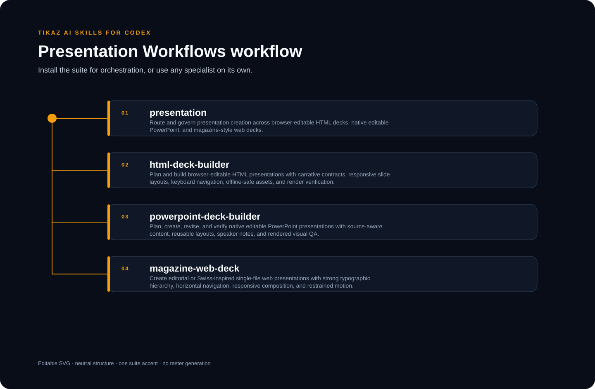

<p align="center"><a href="README.md">English</a> · <strong>简体中文</strong></p>

<p align="center"></p>

# TIKAZ Presentation Workflows for Codex

**以叙事为先，覆盖 HTML、PPTX 和编辑型网页演示，并要求渲染验证。**

由 **TIKAZ** 主导设计、整合、独立重构和持续维护。


<table data-proof-strip="true" width="100%">
<tr>
<td data-proof-cell="true" align="center" width="200" title="HTML 演示、可编辑 PPTX 与编辑式网页演示"><h3>3</h3><sub>输出构建器</sub></td>
<td data-proof-cell="true" align="center" width="200" title="最终成品只由一个构建器负责"><h3>1</h3><sub>每份演示单一构建器</sub></td>
<td data-proof-cell="true" align="center" width="200" title="每页定义主张、证据、视觉任务与讲述意图"><h3>4</h3><sub>页面合同字段</sub></td>
<td data-proof-cell="true" align="center" width="200" title="溢出、碰撞、媒体授权与成品完整性"><h3>4</h3><sub>渲染 QA 门禁</sub></td>
</tr>
</table>

## 🧩 可以单独使用的 Skill

| Skill | 用途 |
|---|---|
| [`presentation`](https://tikazi.github.io/TIKAZ-AI-Skills/zh/skills/presentation/index.html) | 选择输出格式、规划叙事、统一页面合同与验收 |
| [`html-deck-builder`](https://tikazi.github.io/TIKAZ-AI-Skills/zh/skills/html-deck-builder/index.html) | 浏览器可编辑、可离线打开的 HTML 演示 |
| [`powerpoint-deck-builder`](https://tikazi.github.io/TIKAZ-AI-Skills/zh/skills/powerpoint-deck-builder/index.html) | 原生可编辑 PPTX、模板复用、备注与渲染 QA |
| [`magazine-web-deck`](https://tikazi.github.io/TIKAZ-AI-Skills/zh/skills/magazine-web-deck/index.html) | 杂志或瑞士风格的单文件网页演示 |

## 🚀 示例

```text
使用 presentation 判断这个演讲适合 HTML 还是 PPTX，先写页面合同并渲染代表性页面，再完成整套演示。
```

## ⚠️ 限制

- 文件生成成功不代表视觉验收通过，必须渲染检查。
- HTML、PPTX 与网页杂志演示的可编辑性和兼容范围不同。
- 外部模板、字体、图片和构建器许可证仍按原始条款执行。

来源与贡献边界见 [SOURCES.yml](SOURCES.yml) 与 [THIRD_PARTY_NOTICES.md](THIRD_PARTY_NOTICES.md)。

## 🌐 探索 TIKAZ 工作流家族

[🏠 AI Skills](https://github.com/TIKAZI/TIKAZ-AI-Skills) · [⚡ Context Economy](https://github.com/TIKAZI/TIKAZ-Codex-Context-Economy) · [🎨 Frontend Design](https://github.com/TIKAZI/TIKAZ-Codex-Frontend-Design) · [🎬 Video Intelligence](https://github.com/TIKAZI/TIKAZ-Codex-Video-Intelligence) · [🛠️ Engineering](https://github.com/TIKAZI/TIKAZ-Codex-Engineering) · [🔬 Research](https://github.com/TIKAZI/TIKAZ-Codex-Knowledge-Research) · [📽️ Presentation](https://github.com/TIKAZI/TIKAZ-Codex-Presentation) · [🖼️ Visual Content](https://github.com/TIKAZI/TIKAZ-Codex-Visual-Content)
